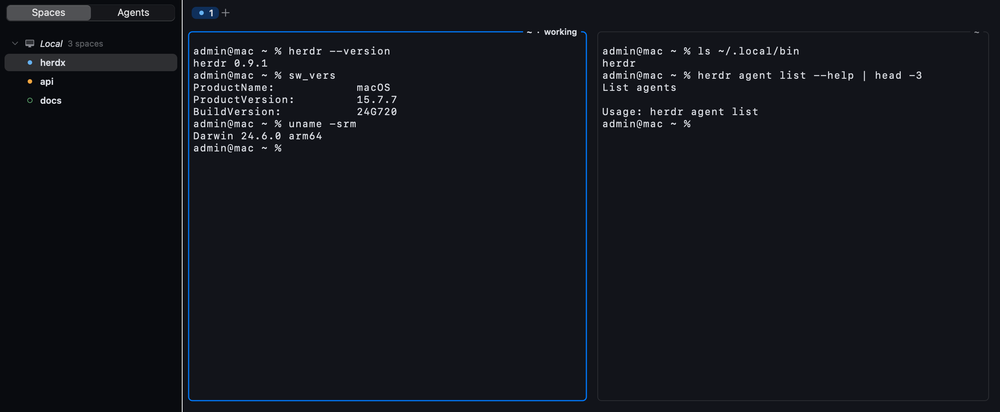

# HerdX

A Mac app for [herdr](https://github.com/herdrdev/herdr), the terminal
multiplexer built for coding agents.



herdr keeps your terminals — and the agents running in them — alive on a server,
so they survive the window being closed, the laptop being shut, and the ssh
connection dropping. HerdX is a native window onto that: real AppKit views, a
Metal-backed terminal, ⌘ shortcuts, macOS notifications. Not a terminal emulator
drawing a picture of a TUI.

- **Every machine in one window.** Your Mac and each ssh remote appear together
  in the sidebar, so an agent that needs you on another box is visible without
  switching to it.
- **Built around agents.** The sidebar can sort by who is working, who is
  blocked and who has finished; finishing and asking make different sounds, and
  only when you are not already looking.
- **Nothing to set up.** Install herdr and HerdX starts a session itself.
- **Your keymap, not ours.** The `ctrl+b` prefix bindings come from your herdr
  config, whatever you have made of them.

## Install

Download the latest `HerdX-*.dmg` from
[Releases](https://github.com/dizzyd/herdx/releases) and drag HerdX to
Applications. It is signed and notarized, so it opens without argument — no
right-click-Open, no Gatekeeper panel.

HerdX needs herdr. If you do not have it, the first launch says so and hands you
the command, with a button that copies it:

```sh
curl -fsSL https://herdr.dev/install.sh | sh
```

That is the whole setup. You do not even need to restart the app — the window
notices herdr arrive, starts a session and attaches to it.

Already running a herdr session? HerdX finds it and joins, and the Session menu
switches between them.

## Using it

The **sidebar** lists every machine and its workspaces. **Spaces** orders them
the way herdr does; **Agents** puts whoever needs you first. Its width is
draggable and ⌃⌘S hides it.

**Tabs** sit above the terminal, and panes split inside a tab. A pane is a real
view with its own frame; the focused one is outlined in the accent colour, and
its working directory and agent state are drawn on its own frame rather than in
a window-level header.

### Keyboard

Everything is in the menu bar, and Help ▸ Keyboard Shortcuts lists both these
and every prefix binding your herdr config defines.

| | |
| --- | --- |
| ⌘T / ⌘W | new tab / close tab |
| ⌘D / ⇧⌘D | split right / split down |
| ⇧⌘W | close pane |
| ⇧⌘] / ⇧⌘[ | next / previous tab |
| ⌥⌘← ↑ ↓ → | move between panes |
| ⇧⌘↩ | zoom the focused pane |
| ⇧⌘N | new workspace |
| ⌘F | find in this pane |
| ⌥⌘C | copy mode |
| ⌃⌘S | show or hide the sidebar |
| ⌃⌘F | full screen |
| ⌥⌘A | sort the sidebar by agent |
| ⌥⌘T | themes |
| ⌘, | settings |

Alongside these, every `ctrl+b` binding from your herdr config works as it does
in the TUI — HerdX reads the keymap out of the server rather than keeping a copy
of its own, and only fills in keys herdr left free.

### Selecting and copying

Drag to select, double-click for a word, triple-click for a line. Selections are
held against the scrollback rather than the visible rows, so they survive output
arriving underneath — which, while an agent works, is constantly.

A program that asked for mouse reporting owns its drags, which is what keeps
editors and pagers usable. Hold ⌥ to select out of one anyway.

Hold ⌘ over a link to see where it goes and ⌘-click to open it. Both real OSC 8
hyperlinks and plain URLs in the output work, including ones that wrapped onto
the next line.

**Copy mode** (⌥⌘C, or ⌘F to enter it searching) moves through the scrollback
without the mouse: `hjkl` and arrows, `ctrl-f`/`ctrl-b` by page, `g`/`G` for the
ends, `/` and `?` to search, `n` for the next match. `v` starts a selection, `y`
or Return copies it, `q` or Esc leaves — and Esc clears a selection before it
exits, so mashing it cannot lose work.

### Sessions

A window is one herdr session, and the **Session** menu lists every session on
this Mac. Switching moves the window to another one, and **New Session…** starts
one under a name of your own — a second window's worth of work kept apart from
the first.

**Stop** ends a session and everything running in it, for every client attached
to it, which is why it asks first. HerdX will not start that one again
afterwards: it starts a session when there is none to attach to, and being told
to stop one is not the same as there being none.

**Attach Machines** decides whether the saved remotes come along with the
session in front of you, or it stays local.

### Several machines

Machines come from herdr's own catalog, and **Machines…** (⇧⌘M) edits it. Each
one runs herdr over ssh, speaking the same protocol as the local server; if a
machine has no herdr on it, HerdX offers to run herdr's installer there in a
pane.

Every machine stays attached so its agents keep reporting, but only the one you
are looking at is asked to render — which is what makes watching several of them
cheap. Each connects and retries on its own, so a machine that is asleep cannot
hold up the others.

### Colours

**Themes…** (⌥⌘T) offers kitty's theme collection — a few hundred palettes,
downloaded on request — and previews each one on the real terminal as you move
through the list, because a list of names tells you nothing about which you want.

The terminal's palette is separate from the window's light or dark appearance,
and Settings can pin either or follow the system.

One thing worth knowing if you also use the herdr TUI: herdr keeps **one theme
per session** and applies whichever client you used last, so two clients with
different colours will fight over it. Settings ▸ Colours takes an exact
background and text colour — the macOS colour panel's eyedropper will sample
them straight off your other terminal — which is what stops it.

### While you are away

An agent that needs you raises a time-sensitive notification, so it breaks
through a Focus mode; one that merely finished does not. Sounds follow the same
rule and stay quiet for a pane you are already watching.

Workspaces that have been idle for hours can be **hibernated** — closed on the
server, remembered here, and brought back with their layout when you click them.
Settings ▸ Hibernate chooses the delay, or turns it off.

### Smaller things

- Images drawn in a pane show up as images — kitty graphics, decoded and cached.
- A program can put something on the Mac clipboard from inside a pane (OSC 52),
  set the window title, and ring a real bell.
- Restart the herdr server and the window reconnects on its own, with the panes
  where you left them.
- Once a day, at startup, HerdX asks GitHub whether a newer version has been
  released and says so if there is one. It does not ask again until the next
  day, however many times you restart it, and it never asks while you work.
- Ligatures are deliberately not supported: every glyph is placed at its own
  cell so long runs stay in their columns, and a ligature spans cells by
  definition. It is a trade, not an oversight.

### Settings

⌘, covers the font and line height, light or dark for the window and the
terminal independently, the palette, the space around panes, the size of pane
labels, agent sounds and hibernation.

## Building it yourself

```sh
git submodule update --init
./scripts/check.sh       # build and test everything
./scripts/bundle.sh      # just build build/HerdX.app
```

You need a Rust toolchain and Xcode's command line tools. No Zig, no tokio, no
PTY — the client does not emulate a terminal, so none of that is needed.

`./scripts/package.sh` builds the signed, notarized universal `.dmg`;
[RELEASING.md](RELEASING.md) covers the certificate and the tag-driven workflow.
[ARCHITECTURE.md](ARCHITECTURE.md) explains how the app is put together and why,
and [AGENTS.md](AGENTS.md) is the working guide for changing it.

## How it works, briefly

herdr's server already does the terminal emulation and exposes a stable,
versioned contract for client-owned shells. HerdX consumes that contract: the
server sends composed cell grids, not raw PTY bytes, and describes the
workspaces, tabs, panes and agents as structured data. So the terminal is a
fast cell renderer and the chrome around it is ordinary AppKit — which is why
the sidebar behaves like a sidebar and not like a picture of one.

The protocol lives in Rust (`herdr-core`, built from herdr's own vendored
sources so the wire format cannot drift) behind a small C ABI that the Swift app
calls. [ARCHITECTURE.md](ARCHITECTURE.md) has the detail.

## Licence

HerdX is Apache-2.0; see `LICENSE`.

That is not an independent choice. `herdr-protocol` compiles herdr's own
Apache-2.0 sources, so herdr's code is linked into the shipped binary and the
licence travels with it. `NOTICE` records what comes from herdr and what the
local shims reproduce, and `bundle.sh` copies both into the app bundle so the
`.dmg` carries them rather than leaving them behind in the repo.
